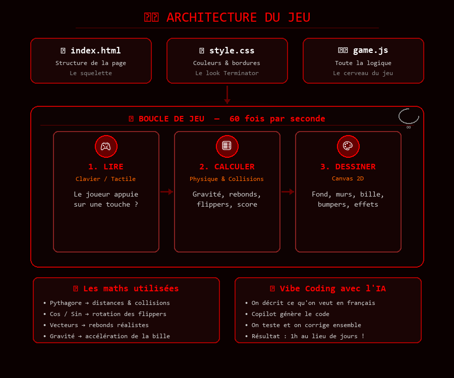

# 🤖 Terminator Pinball

Un jeu de flipper ambiance Terminator jouable dans le navigateur, codé en HTML, CSS et JavaScript.

## 🎮 Comment jouer

- **ESPACE** : maintenir pour charger le lanceur, relâcher pour lancer la bille
- **← →** (flèches) : actionner les flippers gauche / droit
- Sur mobile : boutons tactiles en bas de l'écran

Le but : marquer un max de points en touchant les bumpers ! Tu as 3 billes.

## 🚀 Lancer le jeu

Ouvre le fichier `index.html` dans ton navigateur. C'est tout !

Ou scanne ce QR code pour jouer en ligne :

👉 **https://fredgis.github.io/demostage3ieme/**

## 🧑‍💻 Ce qu'on a appris

- **La boucle de jeu** : le jeu se redessine 60 fois par seconde grâce à `requestAnimationFrame`
- **Les variables** : on stocke le score, la position de la bille, la gravité...
- **Les conditions** : `if (collision)` → la bille rebondit
- **Les fonctions** : chaque action du jeu est découpée en petites fonctions
- **La physique** : gravité, vitesse, friction et rebonds
- **Les maths** : Pythagore pour les collisions, cosinus/sinus pour les flippers
- **Le Canvas** : on dessine directement dans le navigateur
- **Les événements** : on écoute le clavier et l'écran tactile
- **localStorage** : le meilleur score est sauvegardé dans le navigateur

## 📝 Pour le rapport de stage

### Ce que j'ai découvert sur le métier de développeur

Pendant ce stage, j'ai vu comment un développeur travaille au quotidien. Ce n'est pas juste « écrire du code » : il faut d'abord **réfléchir** à ce qu'on veut faire, **découper** le travail en petites étapes, et surtout **tester** souvent pour vérifier que ça marche. Quand quelque chose ne fonctionne pas (un bug), on ne panique pas : on lit les messages d'erreur, on cherche d'où vient le problème, et on corrige. C'est un peu comme un puzzle à résoudre !

J'ai aussi compris que le développeur ne travaille presque jamais seul. Aujourd'hui, il travaille **avec une IA** comme GitHub Copilot, qui est un vrai partenaire de code.

### 🤖 Le Vibe Coding : coder avec l'IA

Ce projet a été réalisé entièrement en **"vibe coding"** : c'est une nouvelle façon de développer où on travaille **main dans la main avec une intelligence artificielle**. Concrètement, au lieu d'écrire chaque ligne de code à la main, on **discute avec l'IA** :

- On lui décrit ce qu'on veut : *"je veux un flipper web avec une ambiance Terminator"*
- L'IA génère le code, on teste, on lui dit ce qui ne va pas : *"la balle traverse les flippers"*
- Elle corrige, améliore, et on recommence jusqu'à ce que ce soit parfait

C'est comme avoir un développeur senior à côté de soi qui code à notre place pendant qu'on donne les directions. On se concentre sur les **idées** et le **résultat**, et l'IA s'occupe de la technique.

> 💡 **Ce que j'ai appris** : le métier de développeur évolue. On n'a plus besoin de tout savoir par cœur. L'important c'est de savoir **expliquer ce qu'on veut**, **tester** et **guider l'IA**. C'est comme être le réalisateur d'un film : on ne tient pas la caméra, mais c'est notre vision qui compte.

### 🏗️ Architecture du jeu (comment ça marche)

### Comment un jeu vidéo fonctionne

Un jeu vidéo, c'est en fait une **boucle** qui tourne très vite (60 fois par seconde !) et qui fait 3 choses à chaque tour :

1. **Lire les entrées** : est-ce que le joueur appuie sur une touche ?
2. **Mettre à jour** : bouger la bille, appliquer la gravité, vérifier les collisions
3. **Dessiner** : afficher le nouveau dessin à l'écran

Pour la physique, on utilise des maths qu'on apprend au collège : la gravité fait accélérer la bille vers le bas, le théorème de Pythagore sert à calculer les distances pour les collisions, et les fonctions cosinus/sinus permettent de faire tourner les flippers.

### Les outils utilisés

- **GitHub Copilot** : l'IA qui a codé le jeu avec nous. On lui parle en français, elle génère le code. C'est l'outil principal du vibe coding !
- **VS Code** : l'éditeur de code. C'est comme un Word, mais pour écrire du code avec de la coloration et de l'aide automatique
- **Git** : un outil qui garde l'historique de toutes les modifications. Si on casse quelque chose, on peut revenir en arrière !
- **GitHub** : un site web où on stocke le code en ligne et où le jeu est hébergé (GitHub Pages)
- **Le navigateur** (Chrome, Edge...) : c'est lui qui exécute notre jeu. On peut aussi y ouvrir les "outils développeur" (F12) pour voir ce qui se passe en coulisses

### Ce qui m'a plu / surpris / posé problème

Ce qui m'a **plu**, c'est le vibe coding ! On n'a pas eu besoin d'écrire une seule ligne de code à la main. On a juste **discuté avec l'IA** en lui disant ce qu'on voulait : un flipper, puis une ambiance Terminator, puis corriger la physique... Et à chaque fois, elle a fait le travail en quelques secondes. C'est comme avoir un super-pouvoir ! En une heure, on a créé un jeu complet qu'il aurait fallu des jours à coder tout seul.

Ce qui m'a **surpris**, c'est à quel point l'IA comprend ce qu'on veut. On lui dit *"la balle traverse les flippers"* et elle sait exactement quel calcul modifier dans le code. On lui dit *"ambiance Terminator"* et elle change toutes les couleurs, ajoute un crâne T-800 et écrit "I'LL BE BACK". Elle comprend aussi bien le français que l'anglais.

Ce qui m'a **posé problème**, c'est qu'il faut quand même **tester et vérifier**. L'IA ne se trompe pas souvent, mais parfois elle oublie un détail ou fait un bug. Il faut savoir repérer les problèmes et bien les expliquer pour qu'elle les corrige. Le métier de développeur change : demain, ce sera surtout **savoir poser les bonnes questions** et **avoir les bonnes idées**.

---

*Projet réalisé lors d'un stage d'observation de 3ème* 🎓
