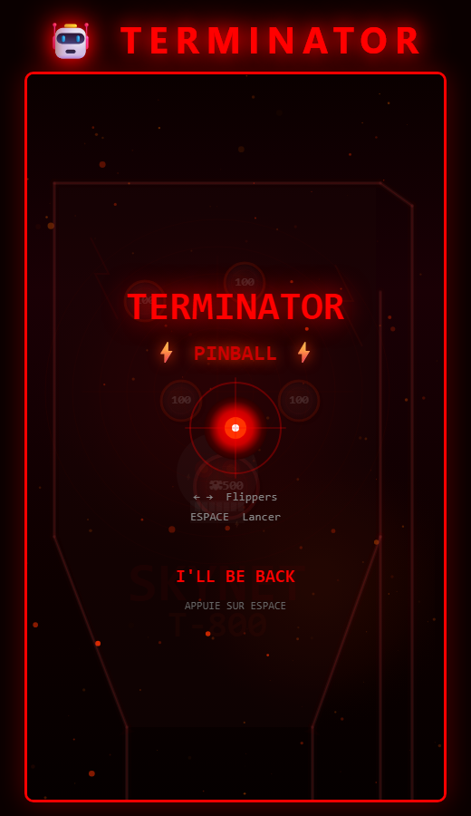
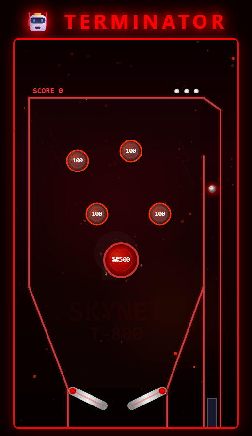

# 🤖 Terminator Pinball

Un jeu de flipper ambiance Terminator jouable dans le navigateur, codé en HTML, CSS et JavaScript.

## 🎮 Comment jouer

- **ESPACE** : maintenir pour charger le lanceur, relâcher pour lancer la bille
- **← →** (flèches) : actionner les flippers gauche / droit
- Sur mobile : boutons tactiles en bas de l'écran

Le but : marquer un max de points en touchant les bumpers ! Tu as 3 billes.

## 🚀 Lancer le jeu

Ouvre le fichier `index.html` dans ton navigateur. C'est tout !

Ou scanne ce QR code pour jouer en ligne :

👉 **https://fredgis.github.io/demostage3ieme/**

## 🧑‍💻 Ce qu'on a appris

- **La boucle de jeu** : le jeu se redessine 60 fois par seconde grâce à `requestAnimationFrame`
- **Les variables** : on stocke le score, la position de la bille, la gravité...
- **Les conditions** : `if (collision)` → la bille rebondit
- **Les fonctions** : chaque action du jeu est découpée en petites fonctions
- **La physique** : gravité, vitesse, friction et rebonds
- **Les maths** : Pythagore pour les collisions, cosinus/sinus pour les flippers
- **Le Canvas** : on dessine directement dans le navigateur
- **Les événements** : on écoute le clavier et l'écran tactile
- **localStorage** : le meilleur score est sauvegardé dans le navigateur

## 📝 Pour le rapport de stage

### Ce que j'ai découvert sur le métier de développeur

Pendant ce stage, j'ai vu comment un développeur travaille au quotidien. Ce n'est pas juste « écrire du code » : il faut d'abord **réfléchir** à ce qu'on veut faire, **découper** le travail en petites étapes, et surtout **tester** souvent pour vérifier que ça marche. Quand quelque chose ne fonctionne pas (un bug), on ne panique pas : on lit les messages d'erreur, on cherche d'où vient le problème, et on corrige. C'est un peu comme un puzzle à résoudre !

J'ai aussi compris que le développeur ne travaille presque jamais seul. Il utilise des outils pour partager son code avec les autres (Git et GitHub), et il doit écrire du code clair pour que ses collègues puissent le comprendre.

### Comment un jeu vidéo fonctionne

Un jeu vidéo, c'est en fait une **boucle** qui tourne très vite (60 fois par seconde !) et qui fait 3 choses à chaque tour :

1. **Lire les entrées** : est-ce que le joueur appuie sur une touche ?
2. **Mettre à jour** : bouger la bille, appliquer la gravité, vérifier les collisions
3. **Dessiner** : afficher le nouveau dessin à l'écran

Pour la physique, on utilise des maths qu'on apprend au collège : la gravité fait accélérer la bille vers le bas, le théorème de Pythagore sert à calculer les distances pour les collisions, et les fonctions cosinus/sinus permettent de faire tourner les flippers.

### Les outils utilisés

- **VS Code** : l'éditeur de code. C'est comme un Word, mais pour écrire du code avec de la coloration et de l'aide automatique
- **Git** : un outil qui garde l'historique de toutes les modifications. Si on casse quelque chose, on peut revenir en arrière !
- **GitHub** : un site web où on stocke le code en ligne. Ça permet de travailler à plusieurs et de montrer son projet au monde entier
- **Le navigateur** (Chrome, Edge...) : c'est lui qui exécute notre jeu. On peut aussi y ouvrir les "outils développeur" (F12) pour voir ce qui se passe en coulisses
- **GitHub Copilot** : une intelligence artificielle qui aide à coder plus vite en proposant du code

### Ce qui m'a plu / surpris / posé problème

Ce qui m'a **plu**, c'est de voir le jeu prendre forme petit à petit. Au début c'est juste un rectangle vide, et à la fin c'est un vrai flipper avec des effets visuels et du son ! C'est très satisfaisant de voir le résultat de son travail directement à l'écran.

Ce qui m'a **surpris**, c'est la quantité de maths et de logique qu'il y a derrière un jeu aussi simple. Juste faire rebondir une bille correctement, ça demande pas mal de calculs ! Et aussi, j'ai été surpris de voir qu'un développeur passe plus de temps à chercher des bugs qu'à écrire du nouveau code.

Ce qui m'a **posé problème**, c'est le couloir de lancement : faire en sorte que la bille suive le bon chemin et arrive sur le plateau de jeu, ça a pris plusieurs essais. Ça m'a appris que coder c'est souvent essayer, se tromper, et recommencer — et c'est normal !

---

*Projet réalisé lors d'un stage d'observation de 3ème* 🎓
